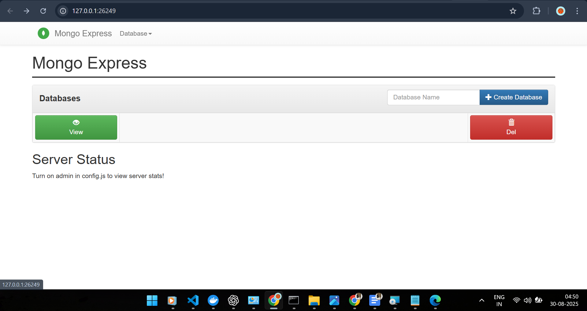
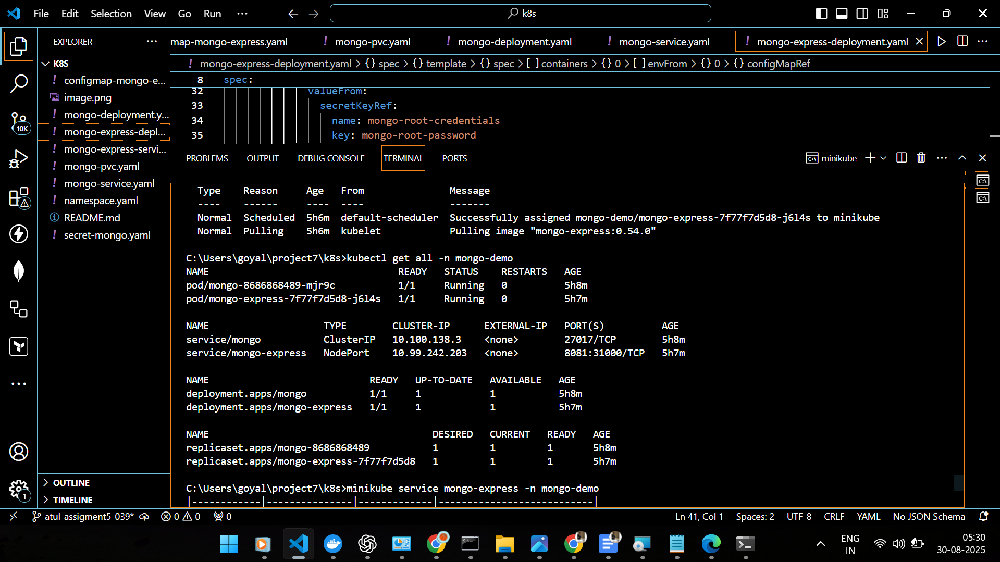

# Create namespace
kubectl create namespace mongo-demo

# Apply MongoDB deployment & service
kubectl apply -f mongo.yaml -n mongo-demo

# Apply Mongo Express deployment & service
kubectl apply -f mongo-express.yaml -n mongo-demo

# Verify all resources in namespace
kubectl get all -n mongo-demo

# Describe MongoDB pod
kubectl describe pod <mongodb-pod-name> -n mongo-demo

# Describe Mongo Express pod
kubectl describe pod <mongo-express-pod-name> -n mongo-demo

# Check logs of MongoDB pod
kubectl logs <mongodb-pod-name> -n mongo-demo

# Check logs of Mongo Express pod
kubectl logs <mongo-express-pod-name> -n mongo-demo

# Port-forward Mongo Express service to access UI
kubectl port-forward service/mongo-express 8081:8081 -n mongo-demo
